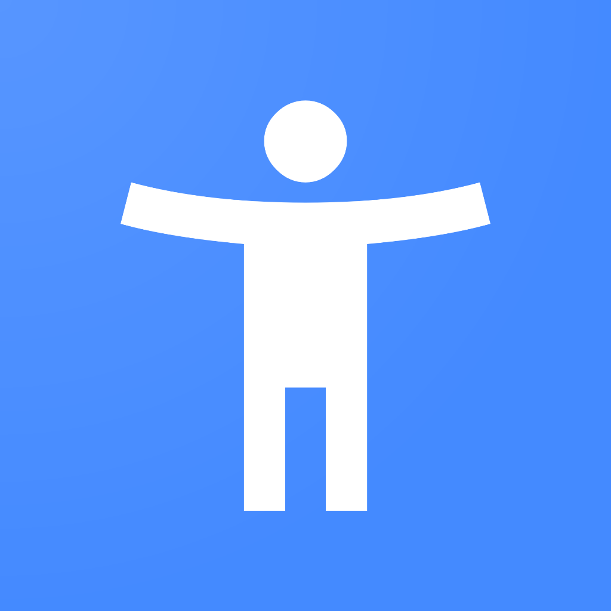
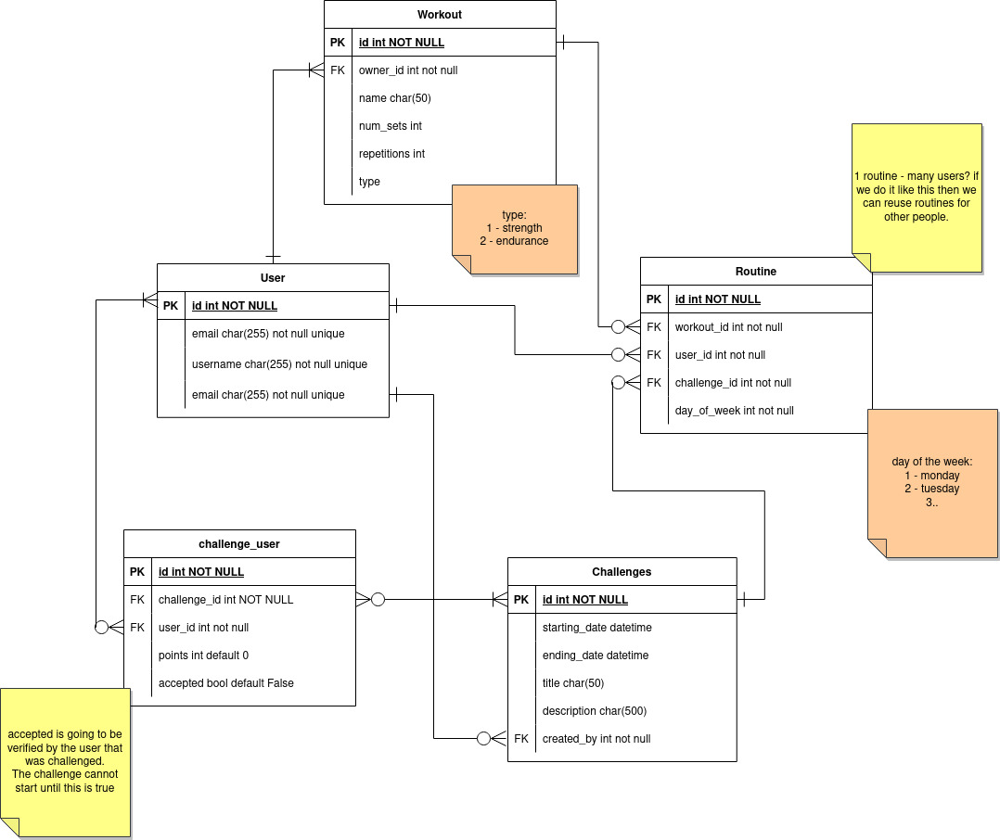
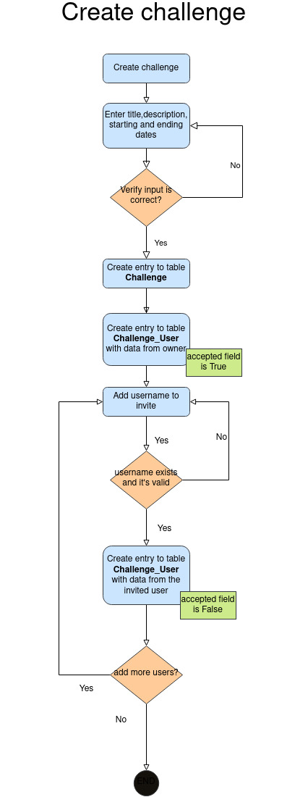

# BuddyChallenge

Challenge yourselves

<strong>BuddyChallenge</strong> is a web application for challenging your friends and family to an exercise routine. 
The application will facilitate and help with maintaining the routines and keeping track 
of a point system for both challengers. 

## Mission Statement
To connect people and their relationship with themselves to become better version of themselves.

## Roadmap

- Create challenge
- Create Workouts
- Create User's profile
- Model/design website

## Diagrams
Use Case

 
UML Database Diagram

 
Flowcharts:

##  Authors
Santiago Paiz - https://github.com/aaoeclipse - https://santiagopaiz.com